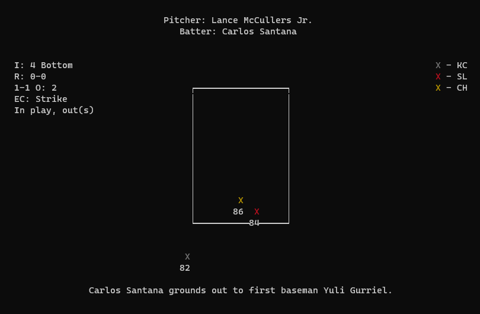
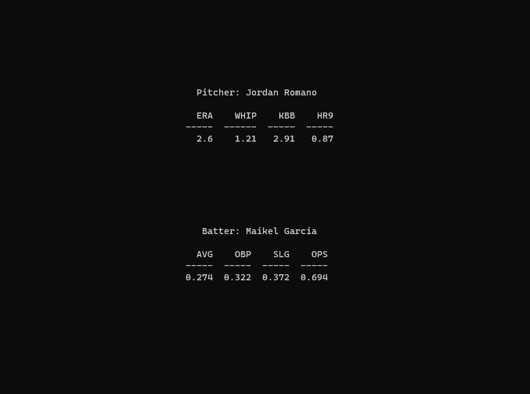
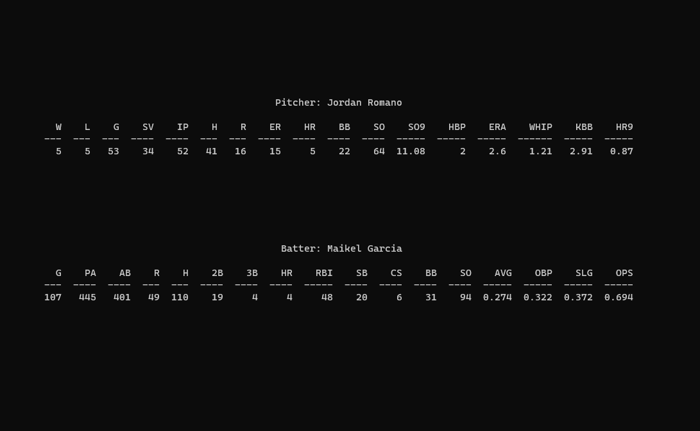

# baseball_live
Retrieves data using [MLB-StatsAPI](https://github.com/toddrob99/MLB-StatsAPI) to visualize live MLB at-bats 
on the terminal using [Python curses](https://docs.python.org/3/library/curses.html).

## Installation
Clone the library and install:
```
git clone https://github.com/davehah/baseball_live
cd baseball_live
pip install -e .
```
## Usage
You can execute the script by typing `baseball_live` in your terminal: 
```
$ baseball_live
```
This command will provide you with the baseball schedule for the current day, with the default time zone set to US-Eastern::
```

            ID  Away                  Home                   Time
          ----  --------------------  ---------------------  ------
              1  Miami Marlins         Philadelphia Phillies  13:05
              2  Seattle Mariners      Tampa Bay Rays         13:10
              3  Chicago White Sox     Detroit Tigers         13:10
              4  Baltimore Orioles     Boston Red Sox         13:35
              5  Los Angeles Dodgers   Washington Nationals   13:35
              6  Pittsburgh Pirates    Atlanta Braves         13:35
              7  Milwaukee Brewers     New York Yankees       13:35
              8  Kansas City Royals    Toronto Blue Jays      13:37
              9  St. Louis Cardinals   Cincinnati Reds        13:40
             10  San Diego Padres      Houston Astros         14:10
             11  New York Mets         Minnesota Twins        14:10
             12  Arizona Diamondbacks  Chicago Cubs           14:20
             13  Oakland Athletics     Texas Rangers          14:35
             14  Cleveland Guardians   Los Angeles Angels     16:07
             15  Colorado Rockies      San Francisco Giants   20:10

```
Type the ID and hit Enter to display the game (pitcher's view, updates every 5 seconds):
<p align="center">
  
</p>   
Left pannel displays innings, runs (away-home), pitch count, number of outs,
expected call (irrespective of umpire's call), and pitch result. The right pannel
displays the legend for pitch types.

## Live/Stat Mode
By default, when launching `baseball_live`, it enters Live Mode, providing you with a near-realtime view of at-bats. To access statistics for both the picher and batter, simply press `j` to switch to Stat Mode:

<p align="center">
  
</p> 

If your terminal window has sufficient space, Stat Mode will automatically showcase  detailed stats (live StatCast data is a work in progress):

<p align="center">
  
</p>

To return to Live Mode, press `k`. If you wish to exit the program, press `q`. 