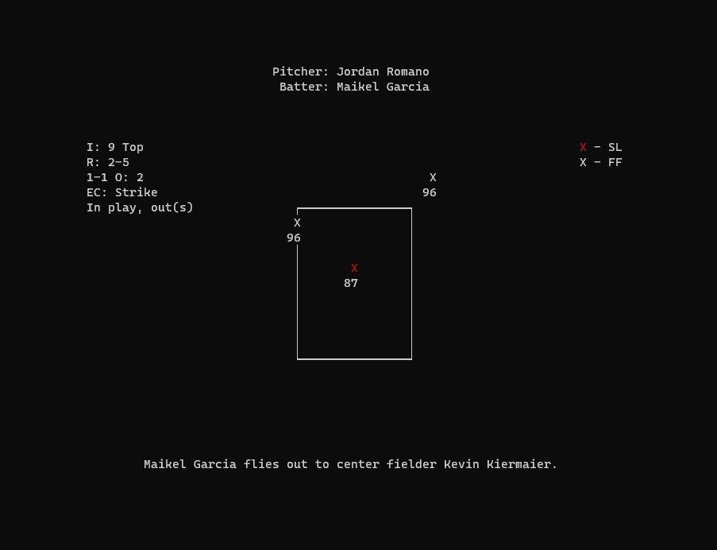

# baseball_live
Live MLB at-bats on the terminal.

## Dependencies
A terminal with 256 color support  
[MLB-StatsAPI](https://github.com/toddrob99/MLB-StatsAPI)  
[tabulate](https://github.com/gregbanks/python-tabulate) 
[arrow](https://github.com/arrow-py/arrow)

## Usage
Call baseball_term.py on the terminal. 
```
python3 baseball_live/baseball_term.py
```
Which returns the baseball schedule for current day (default US-Eastern):
```
              ID  Away                 Home                   Time
            ----  -------------------  ---------------------  ------
               1  Cleveland Guardians  New York Yankees       13:07
               2  Atlanta Braves       Philadelphia Phillies  16:37
               3  Los Angeles Dodgers  San Diego Padres       20:37
```
Type the ID and hit Enter to display the game (pitcher's view):

